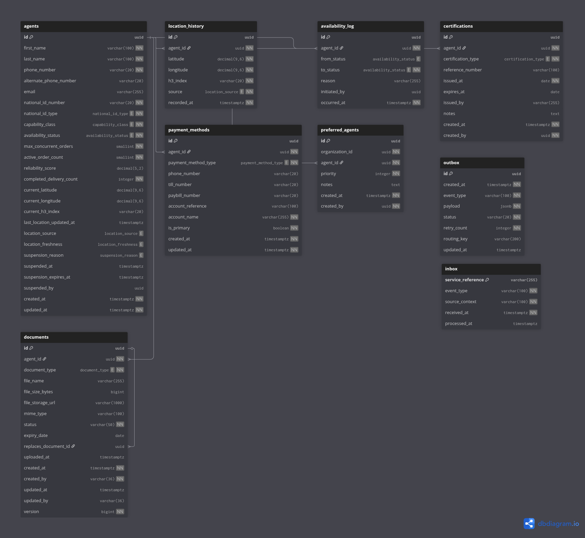

# eBikes Africa — Workforce Management Service

> Manages agent onboarding, availability, location, certifications, documents, suspensions, and preferred agent lists for the eBikes Africa dispatch platform.

---

## Overview

The Workforce Management service is the authoritative source of agent identity and eligibility within the eBikes Africa platform. It governs the full agent lifecycle from onboarding through to real-time availability, and serves the candidate pool that Assignment Strategy draws from.

Agent location is indexed using H3 (resolution 9) for efficient proximity lookup. Document storage uses AWS S3 via presigned URLs — clients upload directly to S3, the service confirms and tracks document state.

**Owns:**

- Agent registration, profile, and capability class
- Availability status and availability log
- GPS location and location history (H3-indexed)
- Certifications and compliance jobs
- Agent documents (presigned S3 upload/download flow)
- Payment methods (M-Pesa personal, till, paybill)
- Suspensions and suspension history
- Preferred agent lists scoped to organisation and branch

**Does not own:**

- Agent proximity scoring for assignment — belongs to Assignment
- Order lifecycle — belongs to Orders
- Vehicle lease management — belongs to Vehicles (future)
- Training certifications — belongs to Training (future)

---

## Platform Context

| Relationship | Service       | How                                                                       |
|--------------|---------------|---------------------------------------------------------------------------|
| Consumed by  | Assignment    | `GET /agents` — H3-filtered eligible candidate pool                       |
| Publishes to | All           | `AgentAvailabilityChanged`, `AgentLocationUpdated` via RabbitMQ outbox    |
| Consumes     | Maker-Checker | `maker-checker.agent.#`, `maker-checker.document.#` routing keys          |
| Auth via     | Keycloak      | JWT / OIDC — all endpoints require Bearer token                           |
| Storage      | AWS S3        | Agent documents via presigned URL — bucket: `ebikes-workforce-docs-{env}` |

---

## Tech Stack

| Concern   | Technology                        |
|-----------|-----------------------------------|
| Language  | Java 21                           |
| Framework | Spring Boot 3.x                   |
| Database  | PostgreSQL (Liquibase migrations) |
| Messaging | RabbitMQ (outbox pattern)         |
| Auth      | Keycloak (JWT / OIDC)             |
| Storage   | AWS S3 (presigned URLs)           |
| Spatial   | H3 resolution 9 (agent indexing)  |

---

## Prerequisites

| Tool           | Version | Notes                                   |
|----------------|---------|-----------------------------------------|
| Java           | 21+     | Use SDKMAN: `sdk install java 21`       |
| Docker         | 20.10+  | Required for all local dependencies     |
| Docker Compose | v2.0+   | Bundled with Docker Desktop             |
| Maven          | 3.9+    | Or use the included `mvnw`              |
| LocalStack     | latest  | S3 emulation for local document uploads |

---

```bash
# 1. Copy environment template and configure
cp .env.example .env
# Edit .env — see inline comments for required values

# 2. Start infrastructure dependencies
docker compose up -d

# 3. Run the service
./mvnw spring-boot:run -Dspring-boot.run.profiles=local
```

> **S3:** Document upload requires a running LocalStack instance. The `.env.example` points to `http://localhost:4566` by default. AWS credentials are not required locally — LocalStack accepts `AWS_ACCESS_KEY_ID=test` and `AWS_SECRET_ACCESS_KEY=test`.

---

## Running Tests
```bash
# Full verify — mirrors the CI quality gate
./mvnw verify

# Unit tests only
./mvnw test
```

Coverage report: `target/site/jacoco/index.html`

---

## Database Schema



---

## Environments & Deployment

| Environment  | Trigger                         | Image tag           |
|--------------|---------------------------------|---------------------|
| `dev`        | Push to `dev` (after CI passes) | `dev` + `sha-*`     |
| `staging`    | Push to `staging` (after CI)    | `staging` + `sha-*` |
| `production` | Release Please semver tag       | `vX.Y.Z` + `sha-*`  |

Images are published to AWS ECR. CI pipeline: `.github/workflows/`